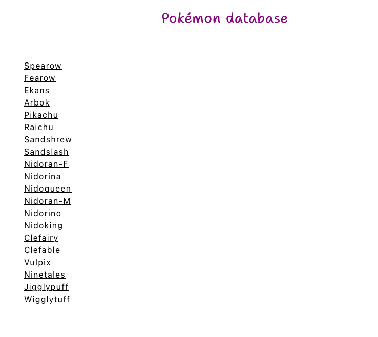
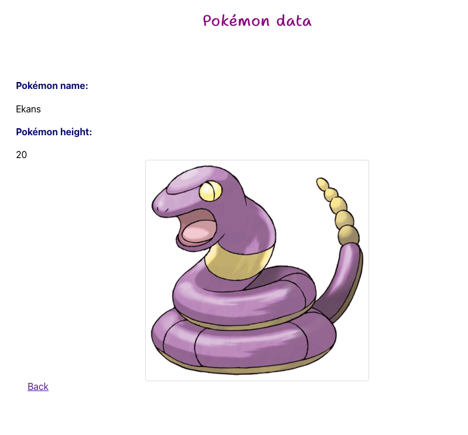

### Week 5 Assignment

For this assignment, I created an app to view a collection of fictional characters using [Pokemon API](https://pokeapi.co/).
This project was bootstrapped with [Create React App](https://github.com/facebook/create-react-app).

### Requirements

For this UI, an app has two views:

* The home page, for displaying a list of characters from API: each character component contains a link to a character detail page. I limited a list of characters per page.

* A character details page displays a specific character's information: a name, an image returned from the API and a height. I am using images from https://pokemondb.net/ resource. 

* Used React Router to switch between views. 
  * One route for rendering the characters list component
    * Used `fetch` to retrieve the character list after mount
  * One route for rendering the character details component
    * Used route params to pass the character ID to the character detail page
    * Uses `fetch` to retrieve the character details after mount
* Styled with CSS on a basic level

### To implement in the future: 
* Enable paging for the character list (if supported by the API)
* Incorporate more pages using other features of your API
* Add a search box feature to the character home page to filter the character list
* Add the ability to "favorite" a character and store favorite characters using the browser's `localStorage` API
* Write tests for each page (note that you may need to learn/use Jest `mock`/`spyOn` APIs to mock the `fetch` call).
